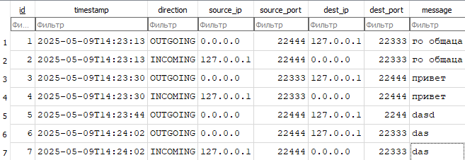

# Coursework: Network & Database Operations (Stage 3)

## Build and Run
### Linux
```bash
git clone git@github.com:matw0x/udp-chat.git && cd udp-chat && mkdir build && cd build && cmake .. && cmake --build . && ./udp-chat
```

Local run:
```bash
./udp-chat --listenport 22333 --targetport 22444 # FIRST TERMINAL
./udp-chat --listenport 22444 --targetport 22333 # SECOND TERMINAL
```
---
### Windows (MinGW)
```powershell
git clone git@github.com:matw0x/udp-chat.git && cd udp-chat && mkdir build && cd build && cmake -G "MinGW Makefiles" .. && cmake --build . && udp-chat.exe
```

Local run:
```bash
udp-chat.exe --listenport 22333 --targetport 22444 # FIRST TERMINAL
udp-chat.exe --listenport 22444 --targetport 22333 # SECOND TERMINAL
```
---
## Example (common file)
